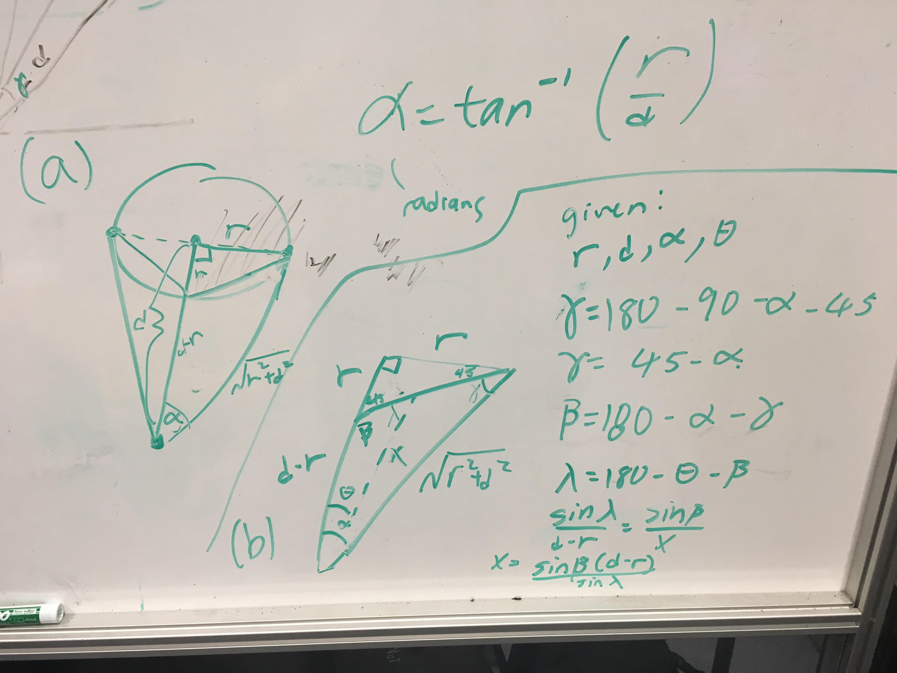

In order to approximate the laser data, we use a bunch of trig.

(a) in the image.
First, to determine the laser angles at which there is a laser response, we determine angle alpha.

(b) in the image.
Next, we approximate the drop-off in laser response as a linear function of how far the laser scan is off from center of the object (x as a function of theta).
we are given r, d, alpha, and theta and compute x with a series of triangle sum and Law of Sines.
